# Platformă online pentru selecția temelor de licență și disertație (BSc/MSc)

[🇬🇧 Versiunea în engleză / English version](README.md)

Acest proiect este conceput pentru a digitaliza și automatiza procesul de selecție a temelor de licență și disertație pentru studenți și profesori. Oferă o abordare structurată și eficientă pentru gestionarea temelor.

## Tehnologii utilizate
### Frontend: Next.js
- **Redux** – pentru gestionarea stării globale
- **Redux Persist** – pentru păstrarea stării Redux între reîncărcări de pagină (folosit în special pentru datele utilizatorului)
- **Axios** – pentru efectuarea cererilor HTTP către backend
- **Nodemailer** – folosit pentru trimiterea de email-uri (gestionate în rutele API)
- **Tailwind CSS** – framework CSS utility-first pentru stilizare
- **Heroicons** – pictograme moderne și scalabile în format SVG

### Backend: Node.js cu Express.js
- **Sequelize ORM** – pentru modelarea și interacțiunea cu baza de date MySQL
- **JWT (jsonwebtoken)** – pentru autentificare securizată prin token-uri
- **Bcryptjs** – pentru hash-uirea sigură a parolelor
- **Sanitize-HTML** – pentru prevenirea XSS și sanitizarea input-ului utilizatorului
- **Dotenv** – pentru gestionarea variabilelor de mediu
- **Cors** – pentru suportul cross-origin
- **Cookie-parser** – pentru parsarea și setarea cookie-urilor

### Autentificare: Google OAuth 2.0 integrat cu JWT
- Utilizatorii se autentifică prin contul Google
- Rolurile și completarea profilului sunt gestionate pe baza verificării email-ului și a regulilor sistemului

### Bază de date: MySQL
- Gestionată prin Sequelize, suportând relații între tabele

### Testare și instrumente de dezvoltare:
- **Cypress** – pentru testare end-to-end
- **Nodemon** – pentru reîncărcare automată în timpul dezvoltării backend-ului

### **Măsuri de securitate**
Platforma implementează mai multe straturi de securitate pentru a asigura protecția datelor și prevenirea acțiunilor neautorizate:

- **Middleware pe backend:** Asigură că utilizatorii pot efectua doar acțiunile permise pentru rolul lor (admin, profesor sau student).
- **Middleware pe frontend:** Restricționează accesul la pagini pe baza rolului utilizatorului, prevenind navigarea neautorizată.
- **Prevenirea acțiunilor neautorizate:** Orice acțiune, precum ștergerea unei cereri sau a unei teme care nu îi aparține utilizatorului, este validată pe backend și blocată dacă nu este autorizată.

Aceste măsuri de securitate mențin integritatea și fiabilitatea platformei.

## Cerințe prealabile
Înainte de rularea proiectului, asigură-te că ai instalat următoarele:
- [Node.js](https://nodejs.org/)
- [MySQL](https://dev.mysql.com/downloads/)
- Un cont Google pentru autentificare OAuth

## Instalare și configurare

### Clonează repository-ul
```bash
git clone --recurse-submodules https://github.com/IoanTimis/LicentaReact.git
```

### Navighează la directorul rădăcină al repository-ului
```bash
cd LicentaReact
```

### Configurează variabilele de mediu
```bash
cp client/sample.env client/.env.local
cp server/sample.env server/.env.local
echo "Actualizează fișierele .env din directoarele 'client' și 'server' înainte de a continua."
```

### Instalare dependințe
```bash
cd client && npm install
```
```bash
cd server && npm install
```

### Pornire proiect
Execută scriptul SQL pentru crearea bazei de date, tabelelor și inserarea datelor inițiale:
```bash
mysql -u <username> -p < server/license.sql
```

Pornește backend-ul și frontend-ul:
```bash
cd server && npm start server.js
```
```bash
cd client && npm run dev
```

## Testare cu Cypress

Pentru a rula testele Cypress, urmează pașii:

1. Navighează în directorul `server`:
   ```bash
   cd server
   ```
2. Deschide interfața Cypress:
   ```bash
   npx cypress open
   ```
3. În interfața Cypress:
   - Selectează **E2E Testing**.
   - Alege browser-ul preferat (de ex. Chrome).
   - Vei vedea trei fișiere de test. Selectează fișierul dorit și vizualizează rezultatele.
4. Asigură-te că variabila de mediu `NODE_ENV` este setată la `test` înainte de rularea testelor.

## Acces în browser
Deschide aplicația la adresa (înlocuiește cu portul specificat în fișierul .env):
```
http://localhost:[PORT]
```

## Vizitează platforma
https://licenta-frontend-opal.vercel.app/ (abonament expirat)

## Prezentare generală
Notă: Aceasta este o demonstrație publică a unei versiuni anterioare a platformei și poate să nu includă cele mai recente funcționalități sau îmbunătățiri. Capturile de ecran de mai jos sunt dintr-o versiune anterioară.

### **Pagina principală**
Pagina principală permite utilizatorilor să navigheze către diferite secțiuni ale platformei și să selecteze limba preferată (română sau engleză).  
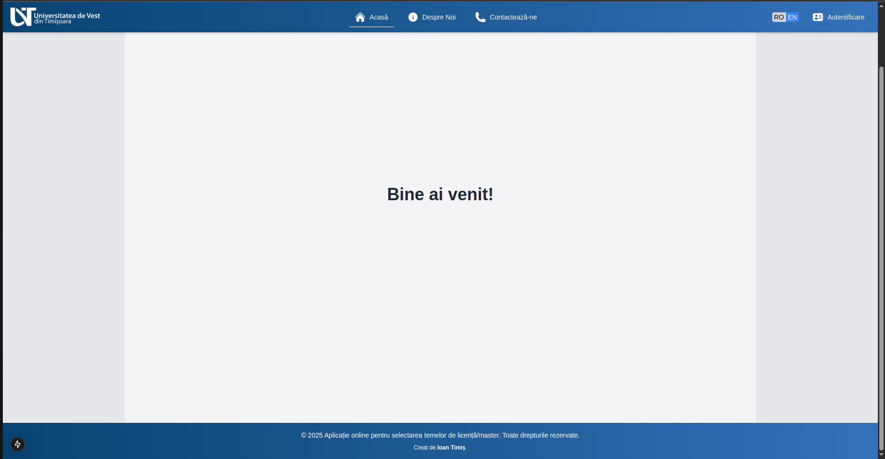

---

### **Pagina de autentificare**
Autentificarea este disponibilă exclusiv prin Google OAuth. Totuși, autentificarea standard rămâne activă în scop de testare. Dacă este specificată o organizație în setările Google OAuth, utilizatorii trebuie să aparțină acelei organizații pentru a se conecta.  
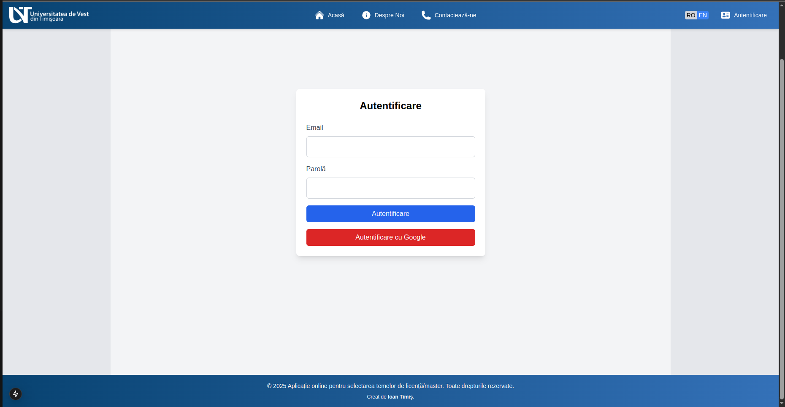

---

### **Panoul de administrare**
După autentificare, administratorii trebuie să adauge în primul rând facultăți, specializări și email-urile profesorilor pentru a configura sistemul.  


---

### **Gestionarea facultăților (Admin)**
Administratorii pot efectua operațiuni CRUD (Creare, Citire, Actualizare, Ștergere) complete pentru facultăți.  


---

### **Pagina profesorului**
După ce un admin a adăugat email-ul unui profesor, acesta se poate autentifica prin Google. Dacă email-ul aparține unui profesor înregistrat, utilizatorul este redirecționat către pagina sa de start.  
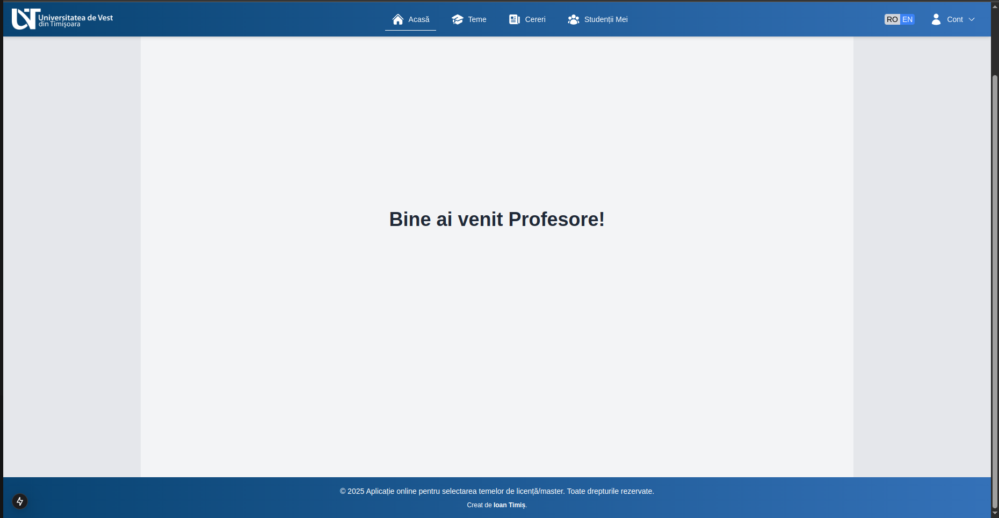

---

### **Pagina temelor (OnlyTeachers dezactivat)**
Dacă `ONLYTEACHERS=false` este setat în variabilele de mediu, studenții pot accesa platforma. Totuși, în această stare, profesorii **nu pot** adăuga subiecte noi.  
Această restricție există deoarece inițial doar profesorii ar trebui să aibă control complet asupra subiectelor. Odată ce studenții sunt înregistrați, profesorii sunt **limitați la modificarea doar a numărului de locuri disponibile**.  
Înainte de a permite studenților accesul, sistemul trebuie să fie setat la `ONLYTEACHERS=true`.  
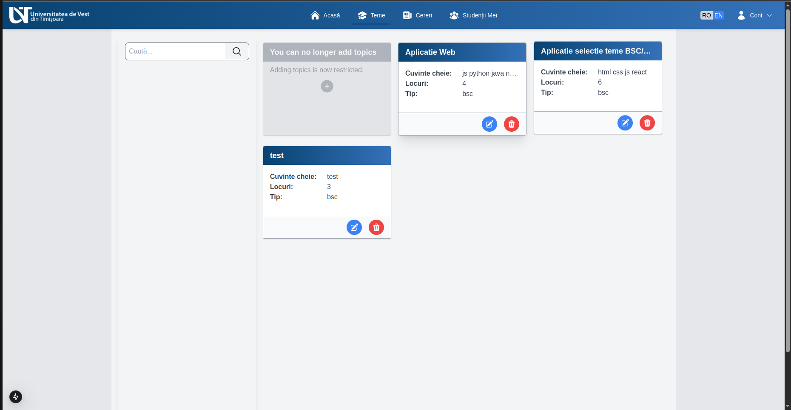

---

### **Pagina temelor (OnlyTeachers activat)**
Când `ONLYTEACHERS=true`, **doar profesorii** se pot autentifica. Aceștia au control complet asupra subiectelor, inclusiv posibilitatea de a crea, actualiza și șterge.  
Profesorii pot filtra subiectele după **nivel de studiu (BSc/MSc)** sau **numărul de locuri disponibile** și pot căuta subiecte după **titlu și cuvinte-cheie**.  
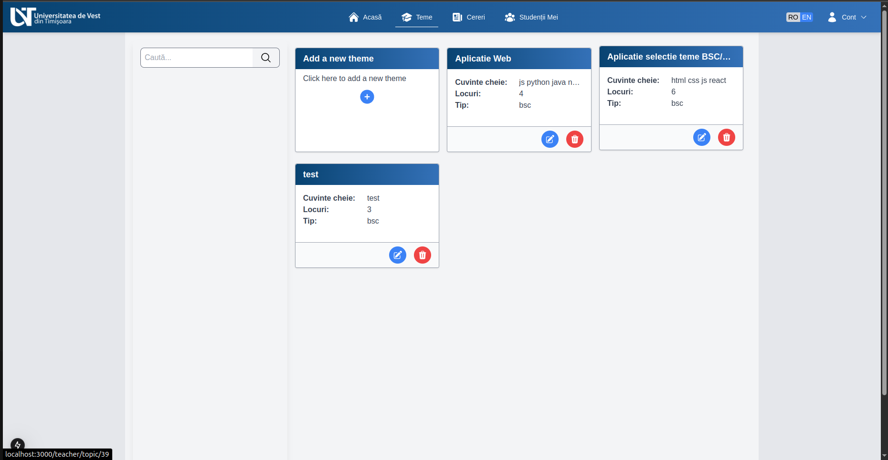

---

### **Pagina cererilor profesorilor**
Profesorii pot **accepta, respinge sau șterge** cererile studenților pentru subiecte.  
De fiecare dată când un profesor ia o acțiune, un **email automat** este trimis studentului cu detalii despre starea cererii.  
Dacă o cerere este **acceptată sau respinsă**, răspunsul va fi înregistrat și ca **comentariu la cerere**.  
Profesorii pot filtra cererile după **stare** și pot căuta cereri după **numele studentului, prenume sau titlul subiectului**.  
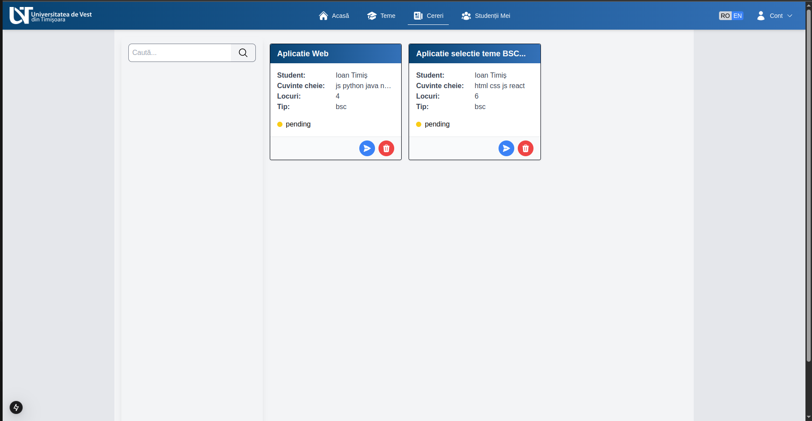

---

### **Modal confirmare**
Pentru orice **acțiuni distructive** (cum ar fi ștergerile), se afișează un modal de confirmare pentru a preveni acțiunile accidentale.  
**Notă:** Dacă o cerere este confirmată, doar **profesorul** va avea autoritatea de a o șterge.  
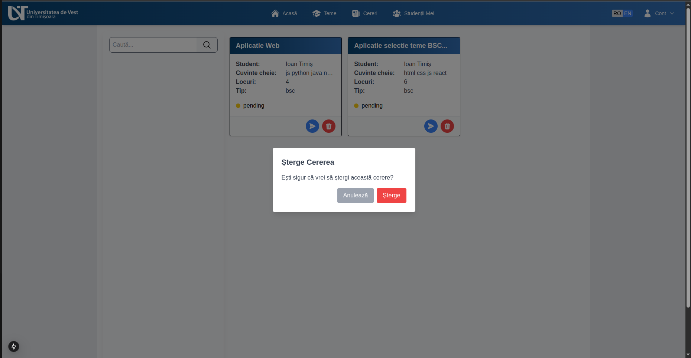

---

### **Modal Teme**

Este oferită o interfață modală pentru profesori care le permite să **modifice sau să adauge** subiecte dacă flag-ul `onlyteachers` este setat la `true`; în caz contrar, pot doar să actualizeze numărul de locuri și nu pot adăuga teme noi.  

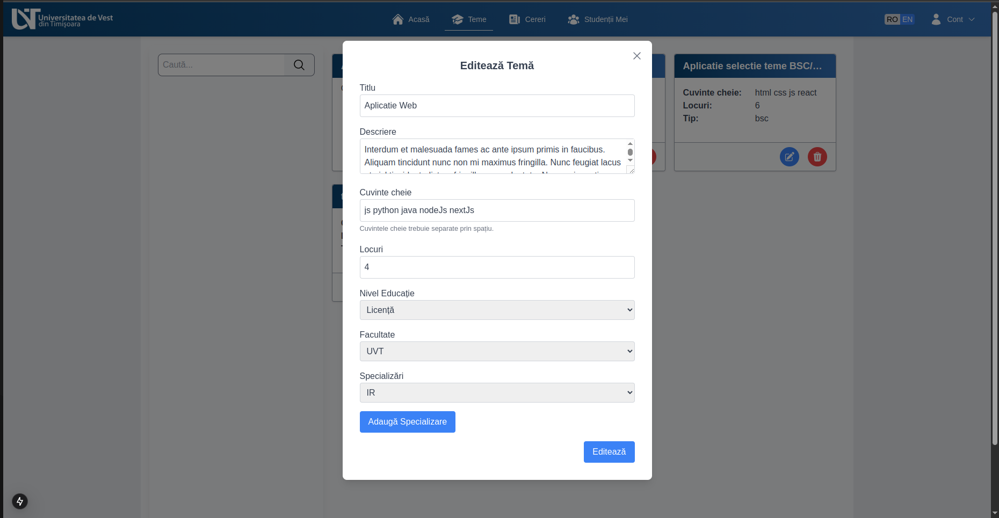

---


### **Modal cerere**
Interfață modal pentru profesori pentru **acceptarea sau respingerea** cererilor studenților.  
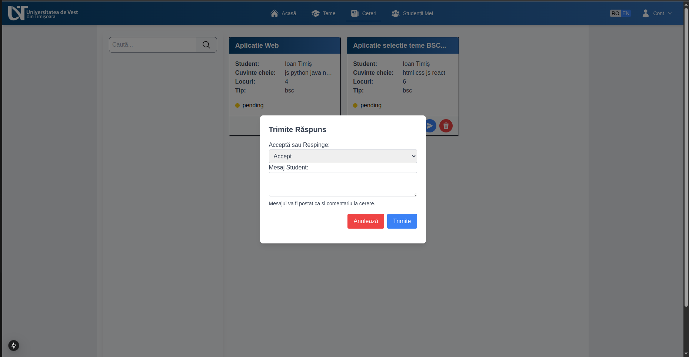

---

### **Pagina studenții mei**
După ce o cerere este **acceptată de profesor** și **confirmată de student**, profesorul poate vizualiza toți studenții care și-au confirmat temele pe pagina **Studenții mei**.  
Profesorii pot filtra studenții după **nivel de studiu (BSc/MSc)** și pot căuta după **titlul temei, numele studentului, prenume sau email**.  


---

### **Completare profil student**
Odată ce configurarea profesorilor este completă, variabila `ONLYTEACHERS` este setată la **false**, permițând studenților să se autentifice.  
La prima autentificare, studenții trebuie să **completeze profilul** furnizând informațiile necesare.  
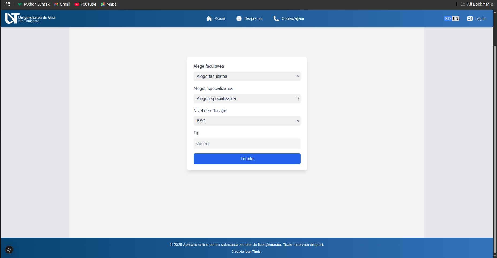

---

### **Pagina temelor studenților**
Pe această pagină, studenții pot vizualiza temele disponibile.  
Implicit, temele sunt **filtrate automat** pentru a îndeplini următoarele criterii:
- **Locuri > 0** (Sunt afișate doar temele cu locuri disponibile)  
- **Potrivire cu nivelul de studiu al studentului (BSc/MSc)**  
- **Potrivire cu facultatea și specializarea studentului**  

Studenții pot:  
- **Căuta teme** după **titlu, cuvinte-cheie, numele profesorului sau prenume**  
- **Solicita o temă**  
- **Adăuga/Elimina o temă din favorite**  
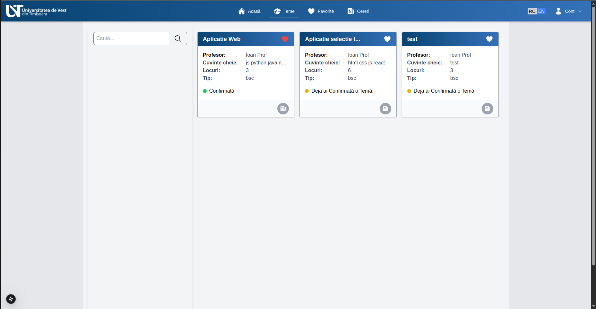

---

### **Pagina temelor favorite**
Studenții își pot gestiona temele favorite de pe această pagină.  
Aceștia pot:
- **Vizualiza toate temele favorite**
- **Solicita o temă**
- **Elimina o temă din favorite**  
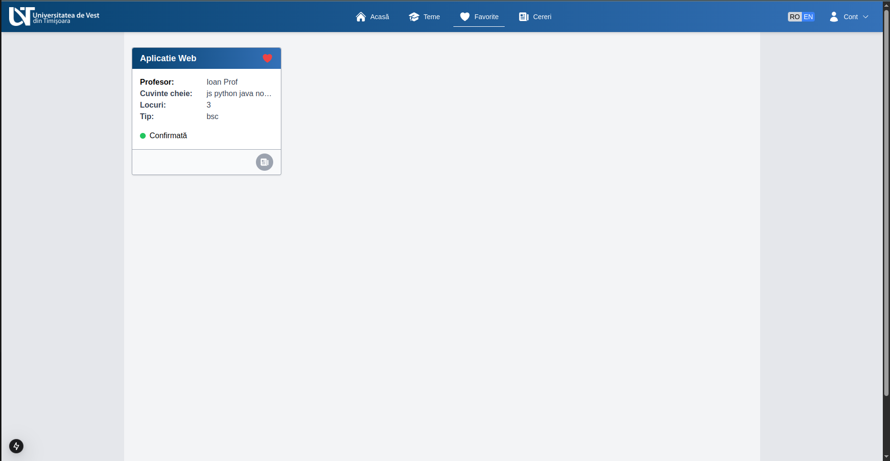

---

### **Pagina cererilor studenților**
Studenții își pot urmări cererile pentru teme pe această pagină.  
Aceștia pot:
- **Filtra cererile după stare**
- **Căuta cereri după numele profesorului, prenume, cuvinte-cheie ale temei sau titlu**
- **Confirmă o cerere**, ceea ce va:
  - **Șterge toate celelalte cereri**
  - **Împiedica studentul să mai trimită alte cereri**
  - **Bloca cererea confirmată pentru a nu putea fi ștearsă de student**
- **Șterge cererile (dacă nu au fost încă confirmate)**  
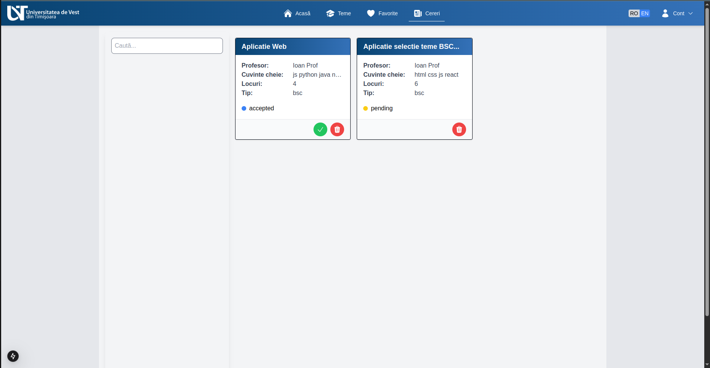

---

### **Pagina dedicată cererii**
Atât **profesorii, cât și studenții** pot face clic pe o cerere pentru a accesa pagina **dedicată** a acesteia pentru mai multe detalii.  
Pe această pagină, studenții și profesorii pot:
- **Vizualiza detalii suplimentare ale cererii**
- **Utiliza secțiunea de comentarii pentru comunicare**
- **Efectua acțiuni (acceptă/respinge/confirmă, după caz)**  


---

### **Pagina dedicată temei**  
Atât **profesorii, cât și studenții** pot face clic pe o temă pentru a accesa pagina **dedicată** a acesteia pentru mai multe detalii.  

- **Studenții** pot vizualiza informații suplimentare despre temă și pot trimite o cerere.  
- **Profesorii** pot revizui detaliile temei, o pot edita sau șterge.  

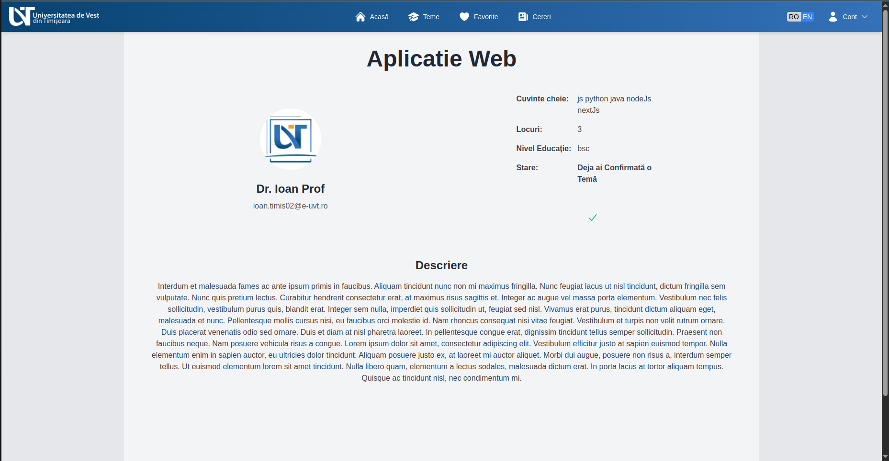

---

### **Design responsive**
Platforma este complet responsive, asigurând o experiență optimă pe toate dispozitivele.  


---

### **Emailuri automate**  
Anumite acțiuni în platformă declanșează **notificări automate prin email**, asigurând o comunicare fluidă între studenți și profesori.  

#### **Când sunt trimise emailurile?**  
- Un student **trimite o cerere** pentru o temă.  
- Un profesor **șterge sau răspunde** la o cerere.  
- Un **comentariu nou este adăugat** la o cerere.  

#### **Suport multilingv**  
- Emailurile sunt trimise în **română** sau **engleză**, în funcție de limba selectată pe platformă.  

#### **Configurare importantă**  
- Pentru funcționalitatea emailurilor, **NODE_ENV trebuie setat la "production"**.  

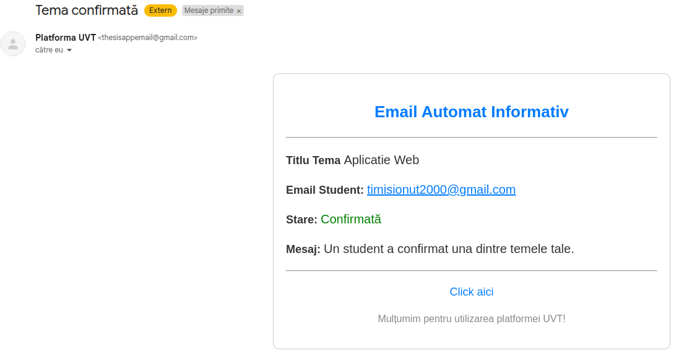

---

