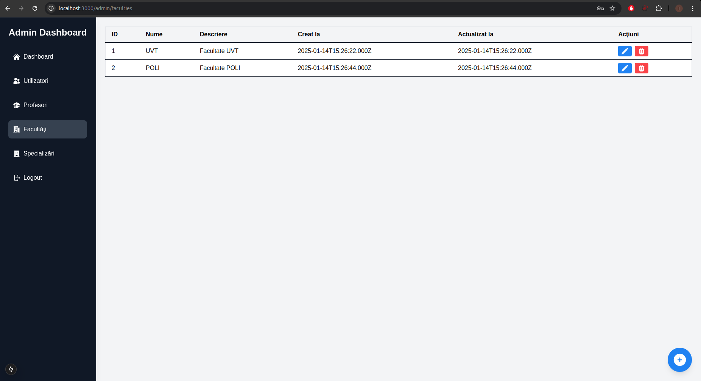

# Platformă online pentru selecția temelor de licență și disertație (BSc/MSc)

[🇬🇧 Versiunea în engleză / English version](README.md)

Acest proiect este conceput pentru a digitaliza și automatiza procesul de selecție a temelor de licență și disertație pentru studenți și profesori. Oferă o abordare structurată și eficientă pentru gestionarea temelor.

## Tehnologii utilizate
### Frontend: Next.js
- **Redux** – pentru gestionarea stării globale
- **Redux Persist** – pentru păstrarea stării Redux între reîncărcări de pagină (folosit în special pentru datele utilizatorului)
- **Axios** – pentru efectuarea cererilor HTTP către backend
- **Nodemailer** – folosit pentru trimiterea de email-uri (gestionate în rutele API)
- **Tailwind CSS** – framework CSS utility-first pentru stilizare
- **Heroicons** – pictograme moderne și scalabile în format SVG

### Backend: Node.js cu Express.js
- **Sequelize ORM** – pentru modelarea și interacțiunea cu baza de date MySQL
- **JWT (jsonwebtoken)** – pentru autentificare securizată prin token-uri
- **Bcryptjs** – pentru hash-uirea sigură a parolelor
- **Sanitize-HTML** – pentru prevenirea XSS și sanitizarea input-ului utilizatorului
- **Dotenv** – pentru gestionarea variabilelor de mediu
- **Cors** – pentru suportul cross-origin
- **Cookie-parser** – pentru parsarea și setarea cookie-urilor

### Autentificare: Google OAuth 2.0 integrat cu JWT
- Utilizatorii se autentifică prin contul Google
- Rolurile și completarea profilului sunt gestionate pe baza verificării email-ului și a regulilor sistemului

### Bază de date: MySQL
- Gestionată prin Sequelize, suportând relații între tabele

### Testare și instrumente de dezvoltare:
- **Cypress** – pentru testare end-to-end
- **Nodemon** – pentru reîncărcare automată în timpul dezvoltării backend-ului

### **Măsuri de securitate**
Platforma implementează mai multe straturi de securitate pentru a asigura protecția datelor și prevenirea acțiunilor neautorizate:

- **Middleware pe backend:** Asigură că utilizatorii pot efectua doar acțiunile permise pentru rolul lor (admin, profesor sau student).
- **Middleware pe frontend:** Restricționează accesul la pagini pe baza rolului utilizatorului, prevenind navigarea neautorizată.
- **Prevenirea acțiunilor neautorizate:** Orice acțiune, precum ștergerea unei cereri sau a unei teme care nu îi aparține utilizatorului, este validată pe backend și blocată dacă nu este autorizată.

Aceste măsuri de securitate mențin integritatea și fiabilitatea platformei.

## Cerințe prealabile
Înainte de rularea proiectului, asigură-te că ai instalat următoarele:
- [Node.js](https://nodejs.org/)
- [MySQL](https://dev.mysql.com/downloads/)
- Un cont Google pentru autentificare OAuth

## Instalare și configurare

### Clonează repository-ul
```bash
git clone --recurse-submodules https://github.com/IoanTimis/LicentaReact.git
```

### Navighează la directorul rădăcină al repository-ului
```bash
cd LicentaReact
```

### Configurează variabilele de mediu
```bash
cp client/sample.env client/.env
cp server/sample.env server/.env
echo "Actualizează fișierele .env din directoarele 'client' și 'server' înainte de a continua."
```

### Instalare dependințe
```bash
cd client && npm install
```
```bash
cd server && npm install
```

### Pornire proiect
Execută scriptul SQL pentru crearea bazei de date, tabelelor și inserarea datelor inițiale:
```bash
mysql -u <username> -p < server/license.sql
```

Pornește backend-ul și frontend-ul:
```bash
cd server && npm start server.js
```
```bash
cd client && npm run dev
```

## Testare cu Cypress

Pentru a rula testele Cypress, urmează pașii:

1. Navighează în directorul `server`:
   ```bash
   cd server
   ```
2. Deschide interfața Cypress:
   ```bash
   npx cypress open
   ```
3. În interfața Cypress:
   - Selectează **E2E Testing**.
   - Alege browser-ul preferat (de ex. Chrome).
   - Vei vedea trei fișiere de test. Selectează fișierul dorit și vizualizează rezultatele.
4. Asigură-te că variabila de mediu `NODE_ENV` este setată la `test` înainte de rularea testelor.

## Acces în browser
Deschide aplicația la adresa (înlocuiește cu portul specificat în fișierul .env):
```
http://localhost:[PORT]
```

## Vizitează platforma
https://licenta-frontend-opal.vercel.app/ (abonament expirat)

## Prezentare generală
Notă: Aceasta este o demonstrație publică a unei versiuni anterioare a platformei și poate să nu includă cele mai recente funcționalități sau îmbunătățiri. Capturile de ecran de mai jos sunt dintr-o versiune anterioară.

### **Pagina principală**
Pagina principală permite utilizatorilor să navigheze către diferite secțiuni ale platformei și să selecteze limba preferată (română sau engleză).  


---

### **Pagina de autentificare**
Autentificarea este disponibilă exclusiv prin Google OAuth. Totuși, autentificarea standard rămâne activă în scop de testare. Dacă este specificată o organizație în setările Google OAuth, utilizatorii trebuie să aparțină acelei organizații pentru a se conecta.  


---

### **Panoul de administrare**
După autentificare, administratorii trebuie să adauge în primul rând facultăți, specializări și email-urile profesorilor pentru a configura sistemul.  


---

### **Gestionarea facultăților (Admin)**
Administratorii pot efectua operațiuni CRUD (Creare, Citire, Actualizare, Ștergere) complete pentru facultăți.  


---

### **Pagina profesorului**
După ce un admin a adăugat email-ul unui profesor, acesta se poate autentifica prin Google. Dacă email-ul aparține unui profesor înregistrat, utilizatorul este redirecționat către pagina sa de start.  


---

### **Pagina temelor (OnlyTeachers dezactivat)**
Dacă `ONLYTEACHERS=false`, studenții pot accesa platforma, dar profesorii **nu pot** adăuga teme noi.  


---

### **Pagina temelor (OnlyTeachers activat)**
Când `ONLYTEACHERS=true`, **doar profesorii** se pot autentifica și au control complet asupra temelor (creare, actualizare, ștergere).  


---

### **Pagina cererilor (Profesori)**
Profesorii pot **accepta, respinge sau șterge** cererile studenților pentru teme.  


---

### **Modal confirmare**
Pentru acțiuni **distructive** (cum ar fi ștergerile), se afișează un modal de confirmare pentru a preveni acțiunile accidentale.  


---

### **Modal cerere**
Interfață modal pentru profesori pentru **acceptarea sau respingerea** cererilor studenților.  


---

### **Pagina studenților**
După ce o cerere este **acceptată de profesor** și **confirmată de student**, profesorul poate vizualiza toți studenții care și-au confirmat temele pe pagina **My Students**.  


---

### **Completare profil student**
După configurarea profesorilor, variabila `ONLYTEACHERS` este setată la **false**, permițând studenților să se autentifice.  


---

### **Teme studenți**
Pe această pagină, studenții pot vizualiza temele disponibile.  


---

### **Favorite studenți**
Studenții pot gestiona temele favorite pe această pagină.  


---

### **Cererile studenților**
Studenții pot urmări cererile pentru teme pe această pagină.  


---

### **Detaliu cerere**
Atât **profesorii cât și studenții** pot accesa detaliile unei cereri.  


---

### **Detaliu temă**
Atât **profesorii cât și studenții** pot accesa detaliile unei teme.  


---

### **Design responsive**
Platforma este complet responsive, asigurând o experiență optimă pe toate dispozitivele.  


---

### **Emailuri automate**
Anumite acțiuni pe platformă declanșează **notificări automate prin email**, asigurând o comunicare fluidă între studenți și profesori.  

