# Online BSc/MSc Thesis Selection Platform

This project is designed to digitalize and automate the process of selecting BSc/MSc thesis topics for students and professors. It provides a structured and efficient approach to thesis management.

## Technologies Used
### Frontend: Next.js
- **Redux** – for global state management
- **Redux Persist** – to persist Redux state across page reloads (used specifically for user data)
- **Axios** – for making HTTP requests to the backend
- **Nodemailer** – used for sending emails (handled in API routes)
- **Tailwind CSS** – utility-first CSS framework for styling
- **Heroicons** – for modern, scalable SVG icons
### Backend: Node.js with Express.js
- **Sequelize ORM** – for MySQL database modeling and interaction
- **JWT (jsonwebtoken)** – for secure authentication via tokens
- **Bcryptjs** – for hashing passwords securely
- **Sanitize-HTML** – to prevent XSS and sanitize user input
- **Dotenv** – for managing environment variables
- **Cors** – for handling cross-origin resource sharing
- **Cookie-parser** – for parsing and setting cookies
### Authentication: Google OAuth 2.0 integrated with JWT
- Users authenticate via their Google account
- Roles and profile completion are managed based on email verification and system rules
### Database: MySQL
- Managed through Sequelize, supporting relationships between tables
### Testing & Dev Tools:
- **Cypress** – for end-to-end testing
- **Nodemon** – for hot reloading during backend development

### **Security Measures**  
The platform implements multiple security layers to ensure data protection and prevent unauthorized actions:  

- **Backend Middleware:** Ensures that users can only perform actions allowed for their role (admin, teacher, or student).  
- **Frontend Middleware:** Restricts access to pages based on the user’s role, preventing unauthorized navigation.  
- **Unauthorized Actions Prevention:** Every action, such as attempting to delete a request or topic that does not belong to the user, is validated at the backend level and blocked if unauthorized.  

These security measures help maintain the integrity and reliability of the platform.

## Prerequisites
Before running the project, ensure that you have the following installed:
- [Node.js](https://nodejs.org/)
- [MySQL](https://dev.mysql.com/downloads/)
- A Google account for OAuth authentication

## Installation and Setup

# Clone the repository
git clone --recurse-submodules https://github.com/IoanTimis/licenta-frontend.git

cd repo

# Configure environment variables
cp client/sample.env client/.env
cp server/sample.env server/.env
echo "Update the .env files in 'client' and 'server' directories before proceeding."

# Install dependencies
(cd client && npm install) &
(cd server && npm install) &
wait

# Start the project
Run the SQL script to create the database, tables, and insert some initial data (server/license.sql).

(cd server && npm start server.js) &
(cd client && npm run dev)

## Cypress Testing

To run Cypress tests, follow these steps:

1. Navigate to the `server` directory:
   ```bash
   cd server
   ```

2. Open the Cypress interface:
   ```bash
   npx cypress open
   ```

3. In the Cypress interface:
   - Select **E2E Testing**.
   - Choose your preferred browser (e.g., Chrome).
   - You will see three test files. Select the file you want to test and view the results.

4. Ensure the `NODE_ENV` environment variable is set to `test` before running the tests.

# Open the application in a browser. Replace with the port specified in your .env file
http://localhost:[PORT]

## Visit the Platform
https://licenta-frontend-opal.vercel.app/  (subscription expired)

## Walkthrough
Note: This is a public demo of an earlier version of the platform and may not include the latest features or improvements. The walkthrough below uses images from a previous version of the application.

### **Landing Page**
The landing page allows users to navigate to different sections of the platform and select their preferred language (Romanian or English).  


---

### **Login Page**
Authentication is available exclusively via Google OAuth. However, standard login remains enabled for testing purposes. If an organization is specified in Google OAuth settings, users must belong to that organization to log in.  
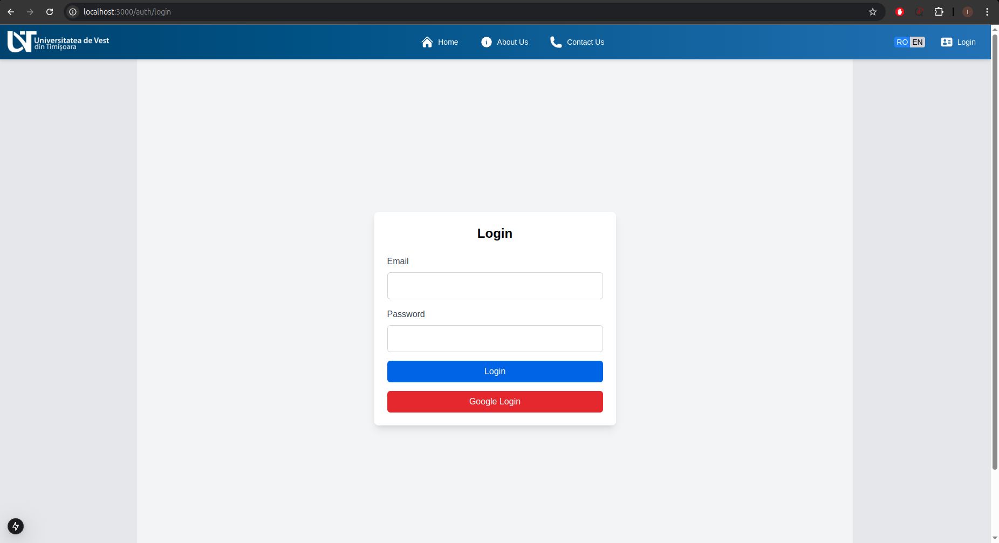

---

### **Admin Dashboard**
Upon logging in, administrators must first add faculties, specializations, and teacher emails to set up the system.  
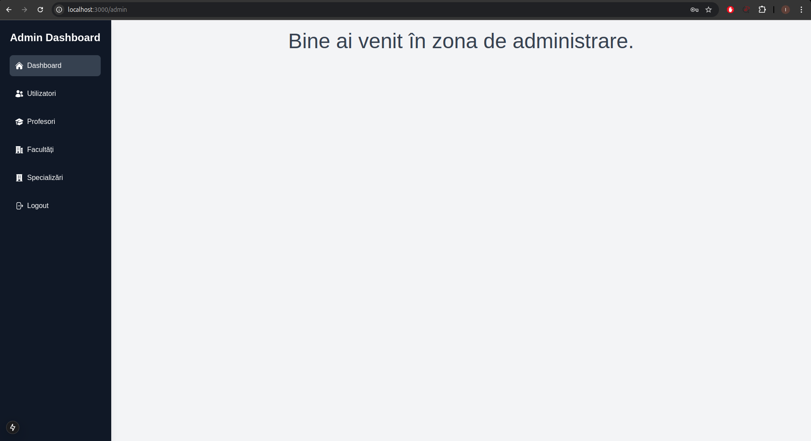

---

### **Admin Faculties Management**
Administrators can perform full CRUD operations (Create, Read, Update, Delete) on faculties from this page.  
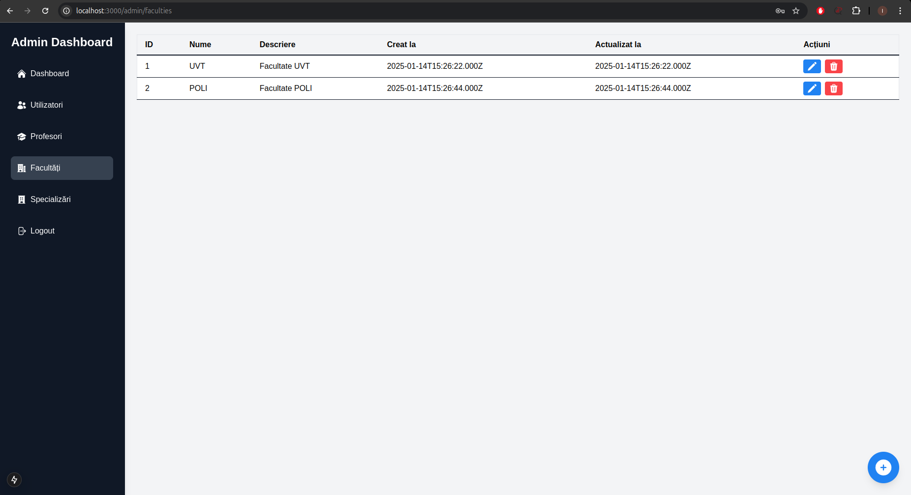

---

### **Teacher Home Page**
Once an admin has added a teacher’s email, they can log in using Google. If the email belongs to a registered teacher, they will be redirected to the teacher’s home page.  
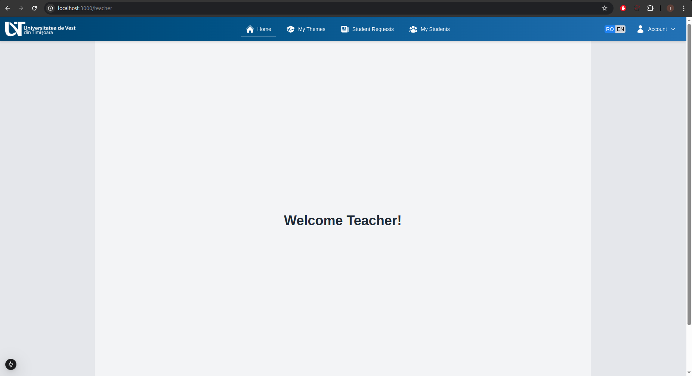

---

### **Teacher Topics Page (OnlyTeachers Disabled)**
If `ONLYTEACHERS=false` is set in the environment variables, students are allowed on the platform. However, in this state, teachers **cannot** add new topics.  
This restriction exists because initially, only teachers should have full control over topics. Once students are onboarded, teachers are **limited to modifying only the number of available slots**.  
Before allowing students, the system should be set to `ONLYTEACHERS=true`.  
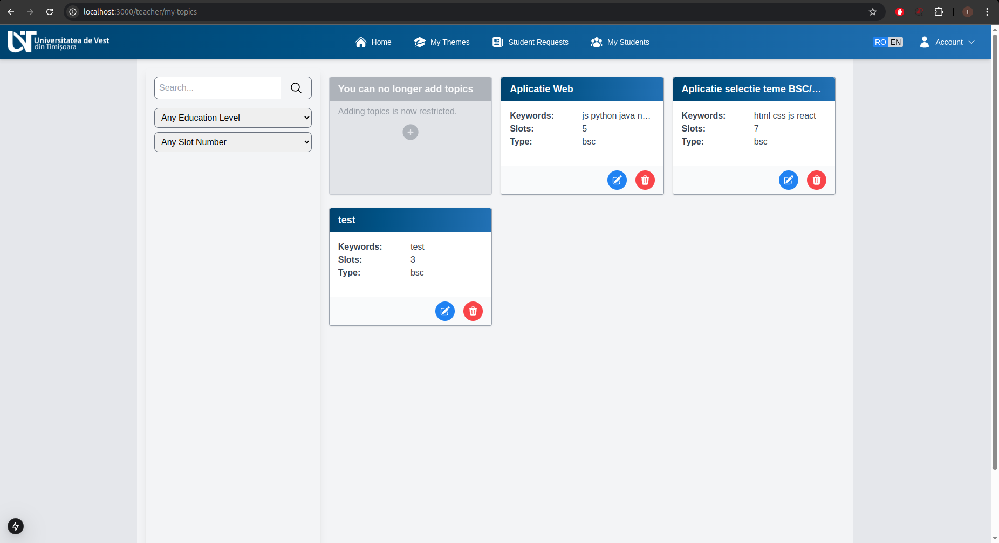

---

### **Teacher Topics Page (OnlyTeachers Enabled)**
When `ONLYTEACHERS=true`, **only teachers** can log in. They have complete control over topics, including the ability to create, update, and delete them.  
Teachers can filter topics by **education level (BSc/MSc)** or **available slots** and search topics by **title and keywords**.  
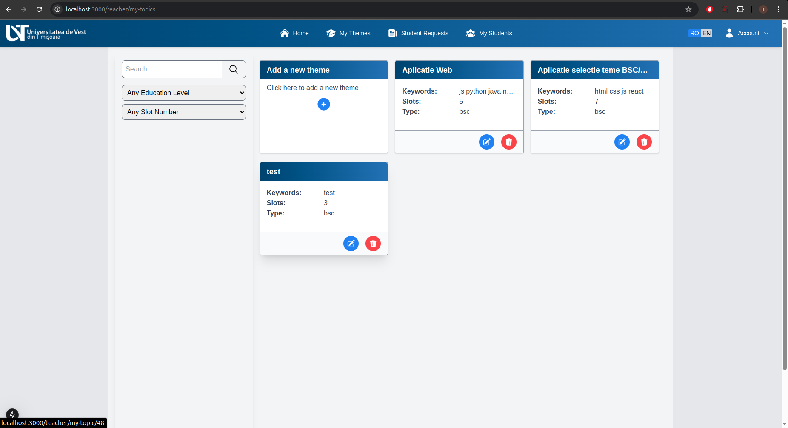

---

### **Teacher Requests Page**
Teachers can **accept, reject, or delete** student requests for topics.  
Whenever a teacher takes an action, an **automated email** is sent to the student with details about the request status.  
If a request is **accepted or rejected**, the response will also be logged as a **comment on the request**.  
Teachers can filter requests by **status** and search requests by **student name, first name, or topic title**.  
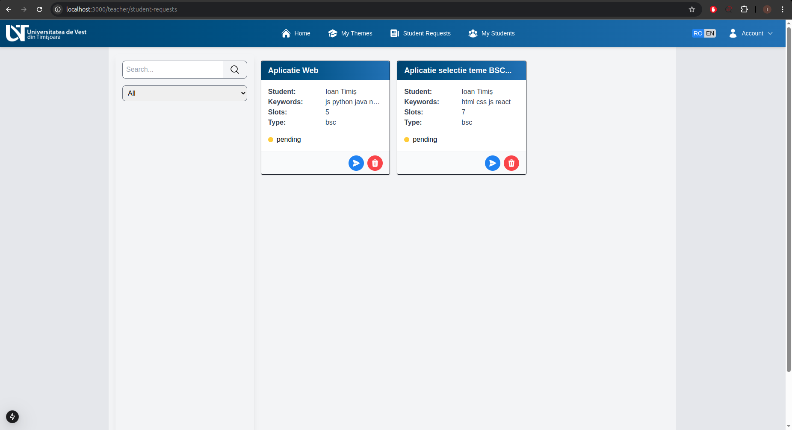

---

### **Confirmation Modal**
For any **destructive actions** (such as deletions), a confirmation modal is displayed to prevent accidental actions.  
**Note:** If a request is confirmed, only the **teacher** will have the authority to delete it.  
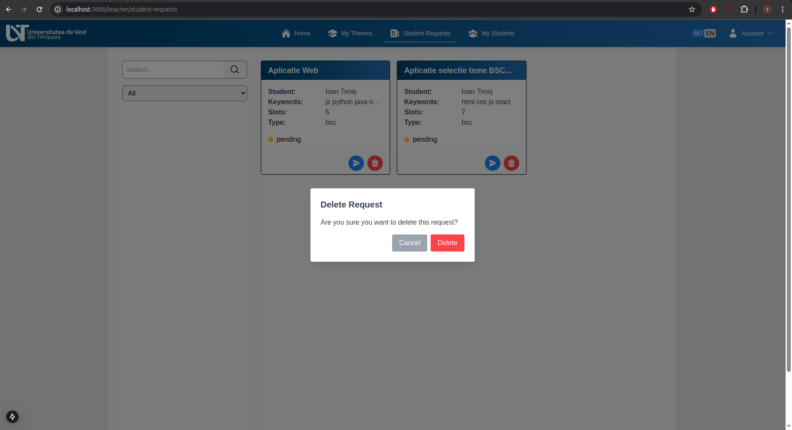

---

### **Request Modal**
A modal interface is provided for teachers to **accept or reject** student requests for a topic.  
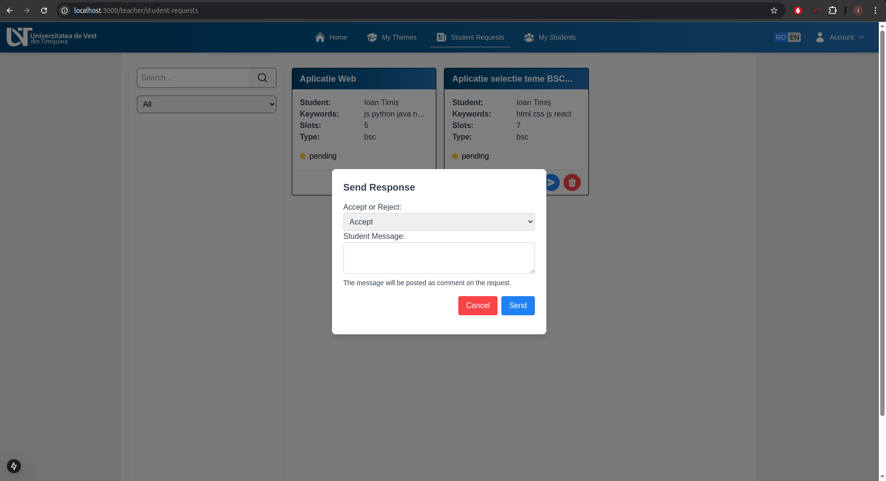

---

### **Teacher My Students Page**  
Once a request is **accepted by the teacher** and **confirmed by the student**, the teacher can view all students who have confirmed their topics on the **My Students** page.  
Teachers can filter students by **education level (BSc/MSc)** and search by **topic title, student name, first name, or email**.  
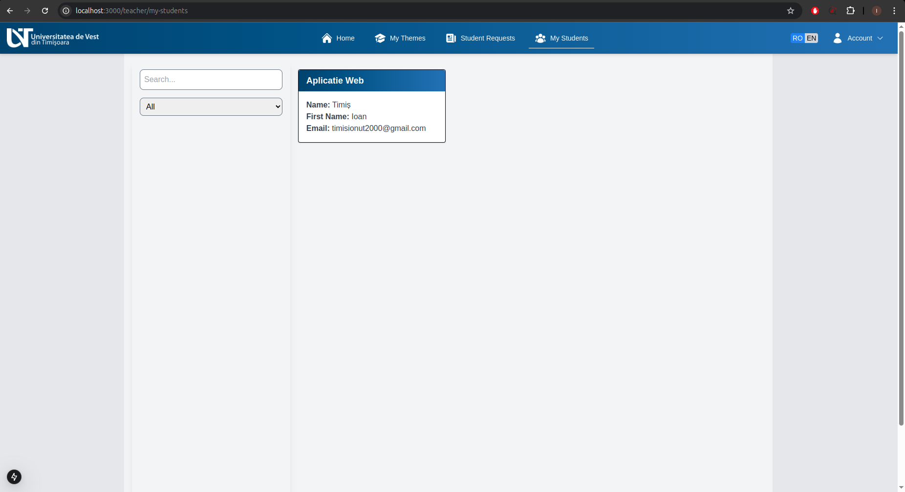

---

### **Complete Profile - Student Page**
Once the teacher setup is complete, the `ONLYTEACHERS` variable is set to **false**, allowing students to log in.  
Upon logging in for the first time, students must **complete their profile** by providing necessary information.  
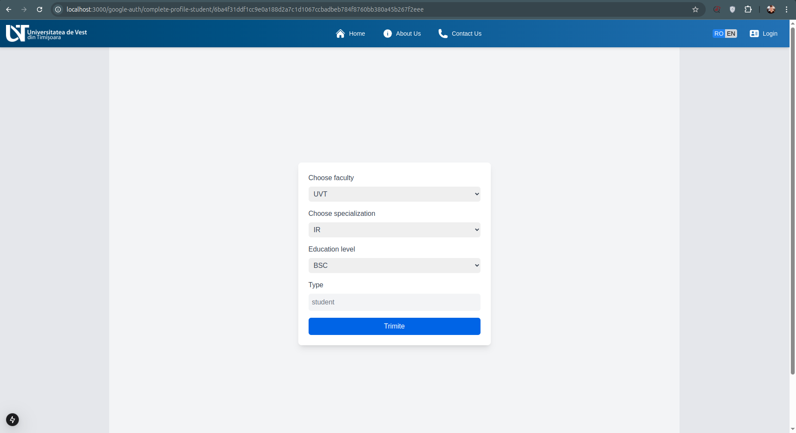

---

### **Student Topics Page**
On this page, students can view available topics.  
By default, topics are **filtered automatically** to meet the following criteria:
- **Slots > 0** (Only topics with available slots are shown)
- **Matches student’s education level (BSc/MSc)**
- **Matches student’s faculty and specialization**  

Students can:
- **Search topics** by **title, keywords, teacher name, or first name**
- **Request a topic**
- **Add/remove a topic from favorites**  
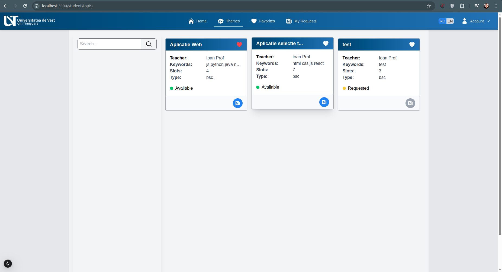

---

### **Student Favorites Page**
Students can manage their favorite topics from this page.  
They can:
- **View all favorite topics**
- **Request a topic**
- **Remove a topic from favorites**  
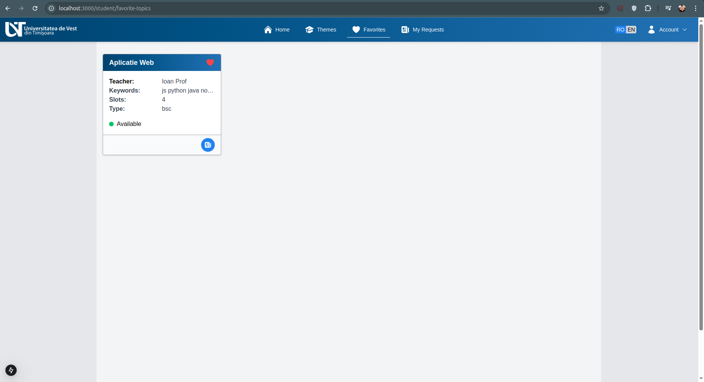

---

### **Student Requests Page**
Students can track their topic requests on this page.  
They can:
- **Filter requests by status**
- **Search requests by teacher name, first name, topic keywords, or title**
- **Confirm a request**, which will:
  - **Delete all other requests**
  - **Prevent the student from making new requests**
  - **Lock the confirmed request from being deleted by the student}
- **Delete requests (if not confirmed yet)**  
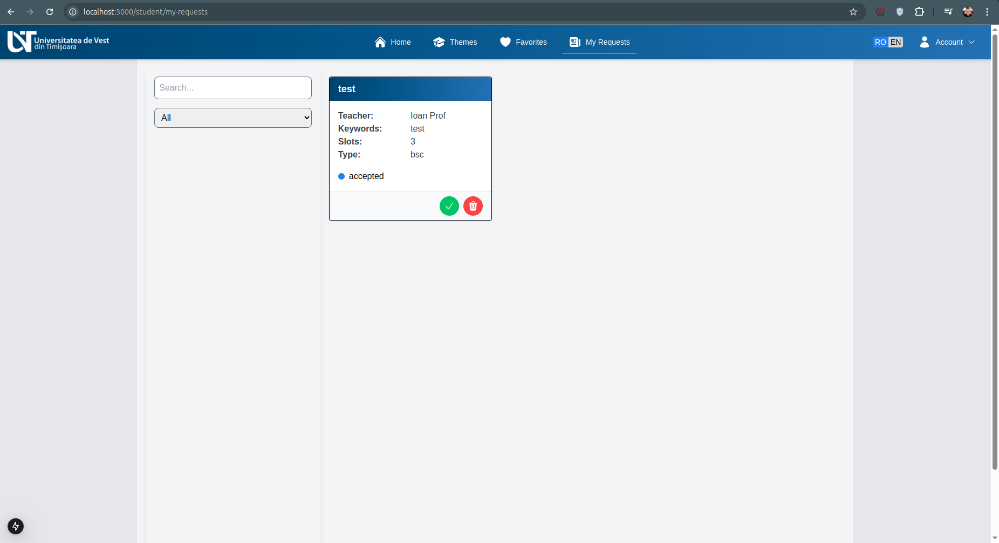

---

### **Student Request Dedicated Page**
Both **teachers and students** can click on a request to access its **dedicated page** for more details.  
On this page, students and teachers can:
- **View additional request details**
- **Use the comment section to communicate**
- **Perform actions (accept/reject/confirm, if applicable)**  
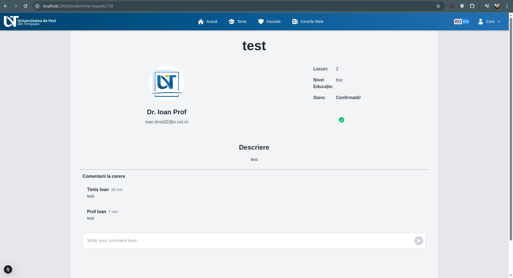

---

### **Student Topic Dedicated Page**  
Both **teachers and students** can click on a topic to access its **dedicated page** for more details.  

- **Students** can view additional information about the topic and submit a request.  
- **Teachers** can review the topic details, edit its content, or delete it.  

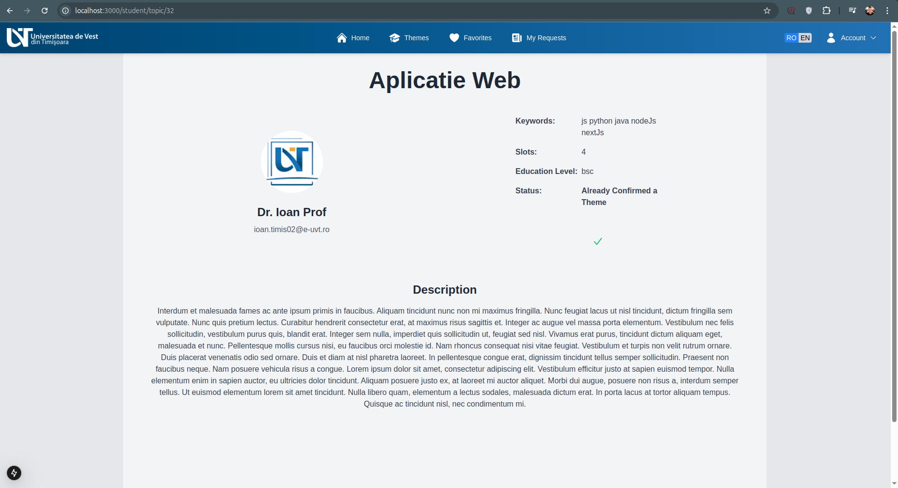

---

### **Responsive Design**  
The platform is fully responsive, ensuring an optimal user experience across all devices, including desktops, tablets, and mobile phones.

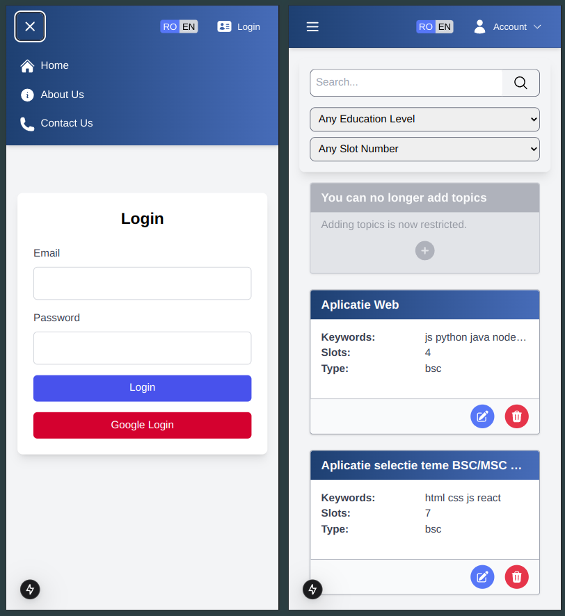

---

### **Automatic Emails**  
Certain actions in the platform trigger **automatic email notifications**, ensuring smooth communication between students and teachers.  

#### **When are emails sent?**  
- A student **submits a request** for a topic.  
- A teacher **deletes or respond to a request**.  
- A new **comment is added** to a request.  

#### **Multilingual Support**  
- Emails are sent in **Romanian** or **English**, depending on the selected language in the platform.  

#### **Important Configuration**  
- For email functionality, **NODE_ENV must be set to "production"**.  

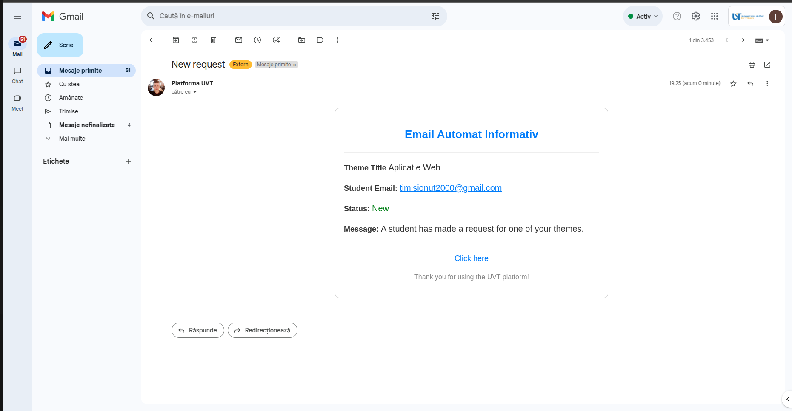


