# Online BSc/MSc Thesis Selection Platform

This project is designed to digitalize and automate the process of selecting BSc/MSc thesis topics for students and professors. It provides a structured and efficient approach to thesis management.

## Technologies Used
- **Frontend:** Next.js
- **Backend:** Node.js, Express.js
- **Authentication:** Google OAuth with JWT security
- **Database:** MySQL with Sequelize ORM

## Prerequisites
Before running the project, ensure that you have the following installed:
- [Node.js](https://nodejs.org/) (Recommended version: `18.x.x` or later)
- [MySQL](https://dev.mysql.com/downloads/)
- A Google account for OAuth authentication

## Installation and Setup

# Clone the repository
git clone https://github.com/user/repo.git
cd repo

# Configure environment variables
cp client/sample.env client/.env
cp server/sample.env server/.env
echo "Update the .env files in 'client' and 'server' directories before proceeding."

# Install dependencies
(cd client && npm install) &
(cd server && npm install) &
wait

# Start the project
(cd server && npm run dev) &
(cd client && npm run dev)

# Open the application in a browser. Replace with the port specified in your .env file
http://localhost:[PORT]

## Walkthrough

### **Landing Page**
The landing page allows users to navigate to different sections of the platform and select their preferred language (Romanian or English).  
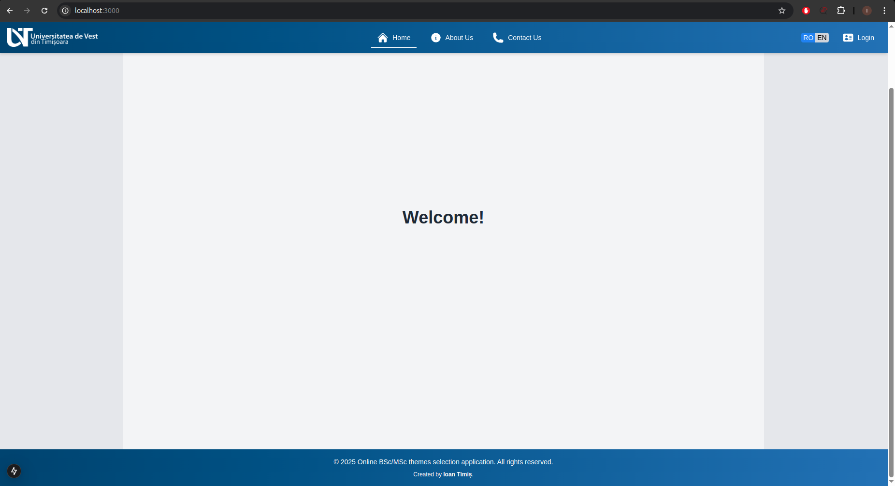

---

### **Login Page**
Authentication is available exclusively via Google OAuth. However, standard login remains enabled for testing purposes. If an organization is specified in Google OAuth settings, users must belong to that organization to log in.  

---

### **Admin Dashboard**
Upon logging in, administrators must first add faculties, specializations, and teacher emails to set up the system.  
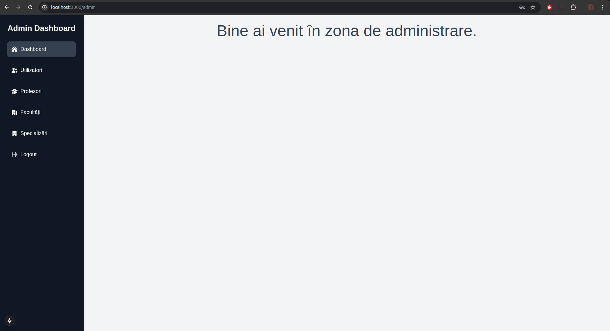

---

### **Admin Faculties Management**
Administrators can perform full CRUD operations (Create, Read, Update, Delete) on faculties from this page.  
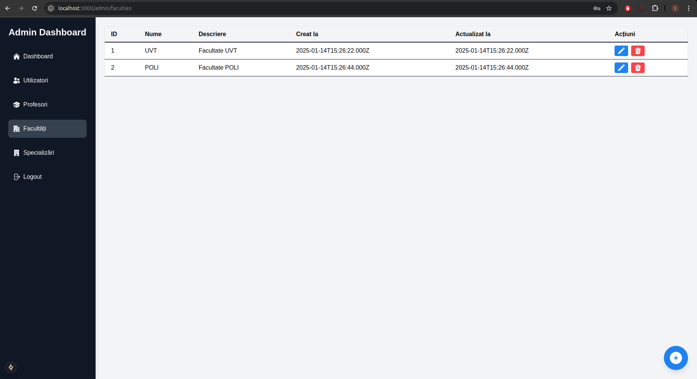

---

### **Teacher Home Page**
Once an admin has added a teacher’s email, they can log in using Google. If the email belongs to a registered teacher, they will be redirected to the teacher’s home page.  
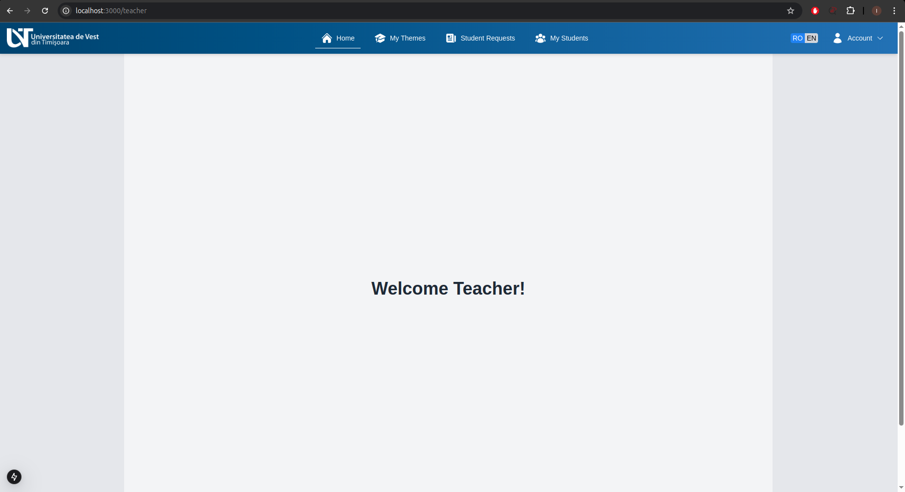

---

### **Teacher Topics Page (OnlyTeachers Disabled)**
If `ONLYTEACHERS=false` is set in the environment variables, students are allowed on the platform. However, in this state, teachers **cannot** add new topics.  
This restriction exists because initially, only teachers should have full control over topics. Once students are onboarded, teachers are **limited to modifying only the number of available slots**.  
Before allowing students, the system should be set to `ONLYTEACHERS=true`.  

---

### **Teacher Topics Page (OnlyTeachers Enabled)**
When `ONLYTEACHERS=true`, **only teachers** can log in. They have complete control over topics, including the ability to create, update, and delete them.  
Teachers can filter topics by **education level (BSc/MSc)** or **available slots** and search topics by **title and keywords**.  
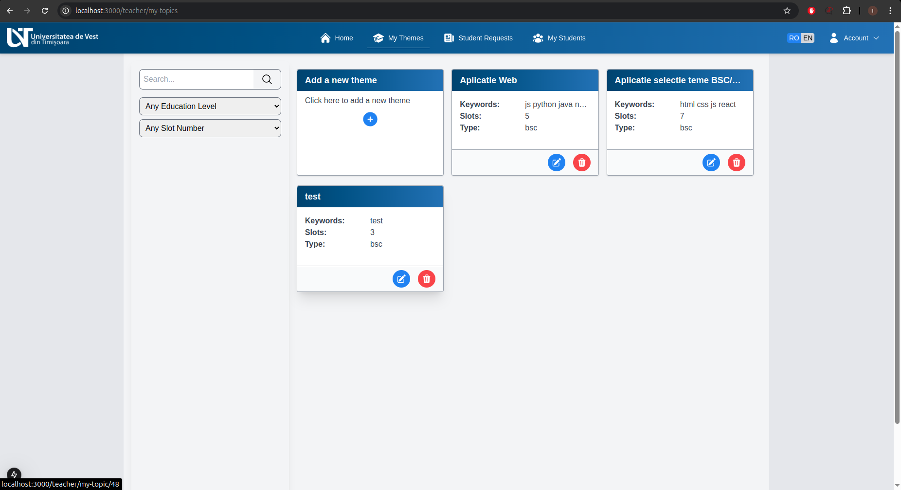

---

### **Teacher Requests Page**
Teachers can **accept, reject, or delete** student requests for topics.  
Whenever a teacher takes an action, an **automated email** is sent to the student with details about the request status.  
If a request is **accepted or rejected**, the response will also be logged as a **comment on the request**.  
Teachers can filter requests by **status** and search requests by **student name, first name, or topic title**.  
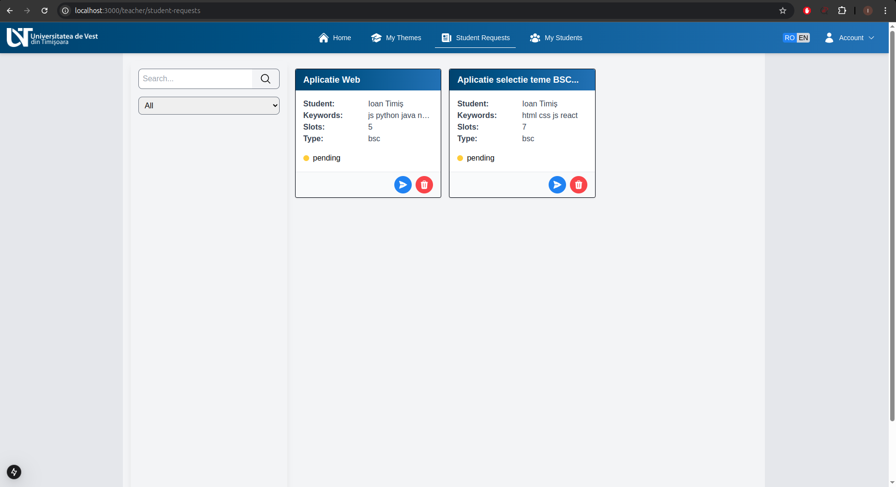

---

### **Confirmation Modal**
For any **destructive actions** (such as deletions), a confirmation modal is displayed to prevent accidental actions.  
**Note:** If a request is confirmed, only the **teacher** will have the authority to delete it.  
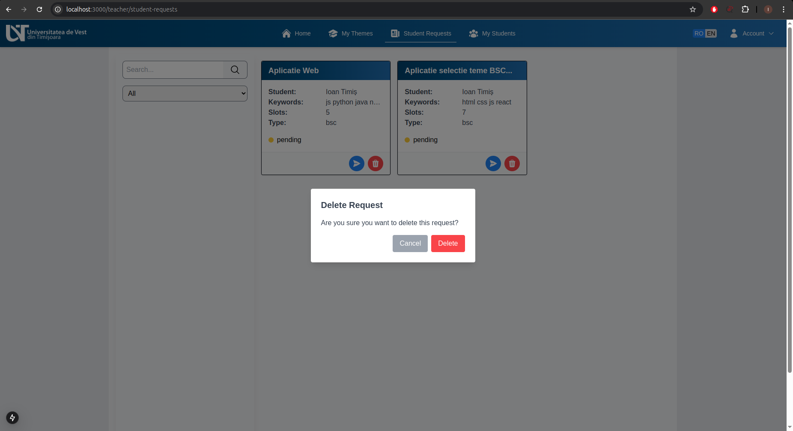

---

### **Request Modal**
A modal interface is provided for teachers to **accept or reject** student requests for a topic.  
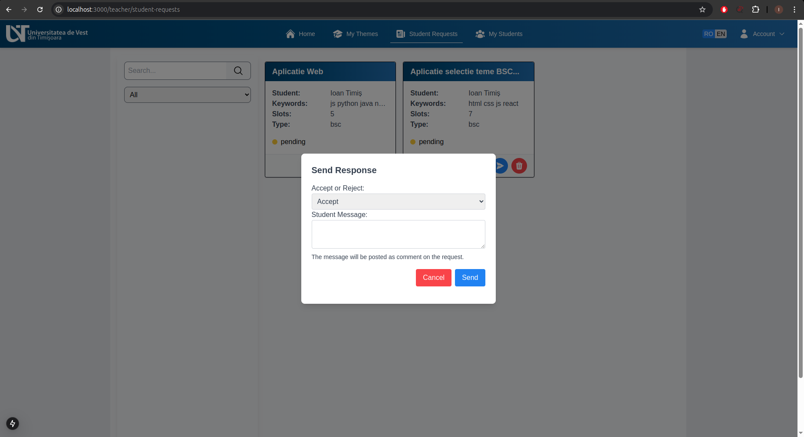

---

### **Teacher My Students Page**
Once a request is **accepted by the teacher** and **confirmed by the student**, the teacher gains access to additional information about the student on the **My Students** page.  
Teachers can filter students by **education level (BSc/MSc)** and search them by **topic title, student name, first name, or email**.  
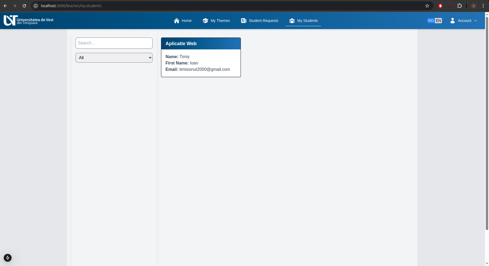

---

### **Complete Profile - Student Page**
Once the teacher setup is complete, the `ONLYTEACHERS` variable is set to **false**, allowing students to log in.  
Upon logging in for the first time, students must **complete their profile** by providing necessary information.  
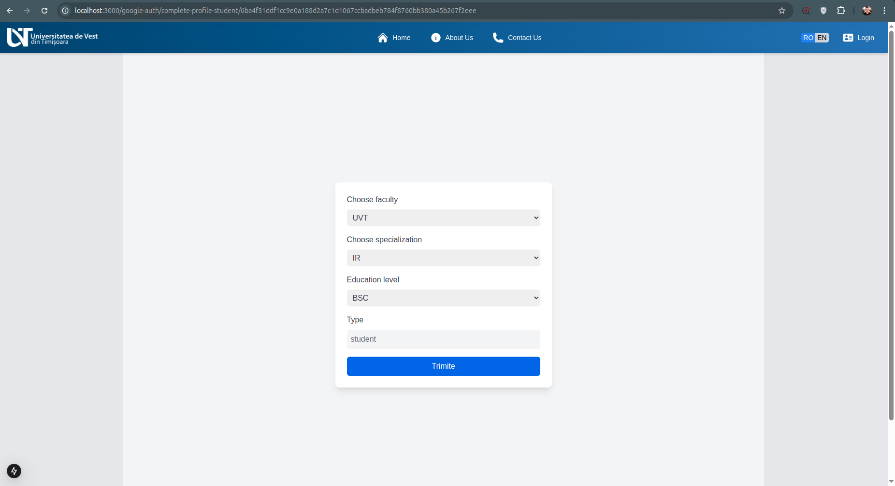

---

### **Student Topics Page**
On this page, students can view available topics.  
By default, topics are **filtered automatically** to meet the following criteria:
- **Slots > 0** (Only topics with available slots are shown)
- **Matches student’s education level (BSc/MSc)**
- **Matches student’s faculty and specialization**  

Students can:
- **Search topics** by **title, keywords, teacher name, or first name**
- **Request a topic**
- **Add/remove a topic from favorites**  
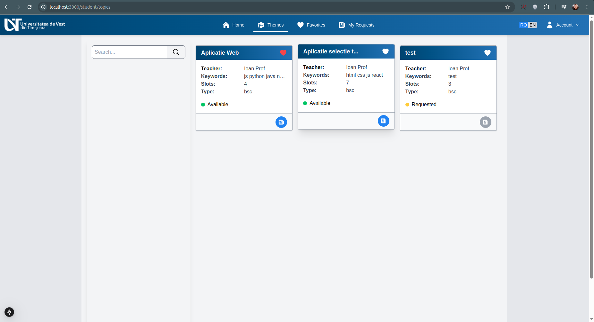

---

### **Student Favorites Page**
Students can manage their favorite topics from this page.  
They can:
- **View all favorite topics**
- **Request a topic**
- **Remove a topic from favorites**  
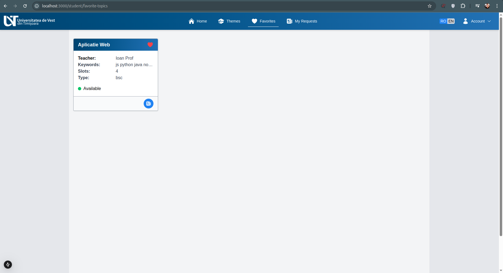

---

### **Student Requests Page**
Students can track their topic requests on this page.  
They can:
- **Filter requests by status**
- **Search requests by teacher name, first name, topic keywords, or title**
- **Confirm a request**, which will:
  - **Delete all other pending requests**
  - **Prevent the student from making new requests**
  - **Lock the confirmed request from being deleted by the student**
- **Delete requests (if not confirmed yet)**  
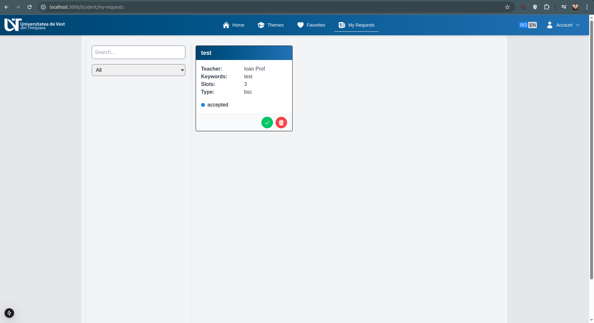

---

### **Student Request Dedicated Page**
Both **teachers and students** can click on a request to access its **dedicated page** for more details.  
On this page, students and teachers can:
- **View additional request details**
- **Use the comment section to communicate**
- **Perform actions (accept/reject/confirm, if applicable)**  
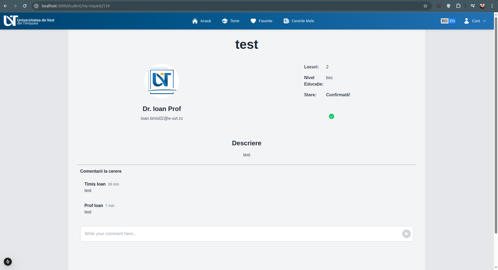

